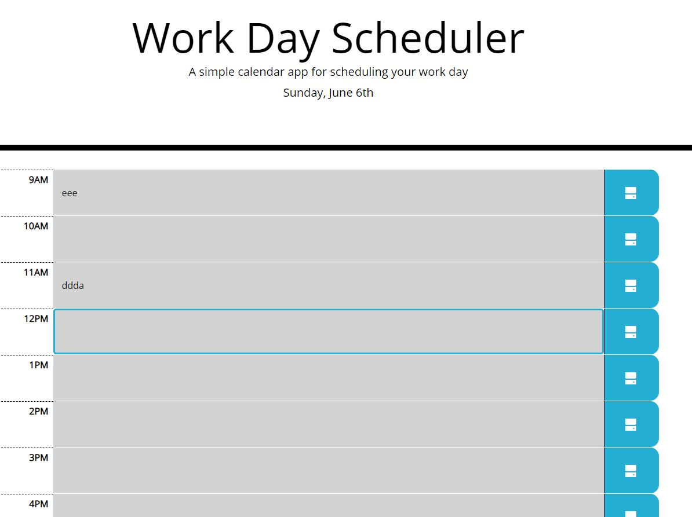

# Work Day Scheduler 

This is the Work Day Scheduler that allows to enter and save to the Local Storage events for each working hour of the day (9am - 5pm).
Events with the past time show in gray, current hour is in red, and future events are in green. 
Events currently edited are outlined by blue border. To save an event you need to click the "Save" button near the event.

It is built by using HTML, CSS, JavaScript, Bootstrap and jQuery.

# Deployed web site

The link to deployed site is https://evkonradi.github.io/scheduler/.

# GitHub repository

You can find the repository here: https://github.com/evkonradi/scheduler.

# Page preview

This is the preview of the initial page:

